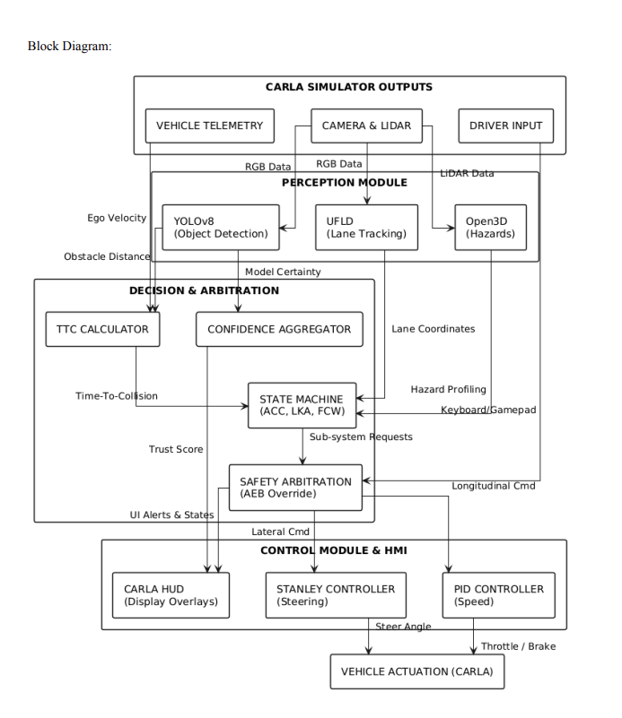

# Virtual Vahana: Integrated Decision-Intelligence ADAS


**Event:** Virtual Vahana Contest 2026 (Phase 1 Technical Submission)  
**Institution:** Amrita Vishwa Vidyapeetham, Kollam, Kerala  
**Team Members:** Y Sai Sailesh Reddy | Bhavana PH | Sidharth R Krishna  

---

## 🚙 Project Overview
This repository contains a closed-loop Advanced Driver Assistance System (ADAS) engineered for the CARLA autonomous driving simulator. The system features a custom, GPU-accelerated perception pipeline that fuses **YOLOv8** (Dynamic Object Detection) and **UFLDv2** (Ultra Fast Lane Detection). 

To combat simulator domain shift and screen-space latency, this project discards traditional temporal smoothing (EMA/Kalman filters) in favor of a **Zero-Latency Perspective Mapping Algorithm**. By mathematically translating 2D row-classifications into 3D simulator space using custom Field-of-View (FOV) scalars, the system guarantees physical lane adherence and drives a highly responsive arbitration engine.

## 🎥 Simulator Demo (3–5 Minutes)

A short demonstration of the implemented ADAS features in the CARLA simulator.

**Demo Video:**  
https://your-video-link-here

The video demonstrates:
* Lane Detection using UFLDv2
* Lane Departure Warning (LDW)
* Time-to-Collision (TTC) based Forward Collision Warning
* Autonomous Emergency Braking (AEB)
* Traffic Light Detection and Intersection Compliance
* Real-time HUD visualization

### 🌟 Key Technical Features
* **Zero-Latency Lane Tracking:** Instantaneous polynomial curve fitting mapping 2D UFLD classifications directly to the 3D CARLA environment.
* **Domain Shift Calibration:** Custom FOV scaling (1.25x) and linear horizon mapping to adapt real-world 60° dashcam training weights to 90° simulated lenses.
* **Bulletproof LDW:** Bumper-level lane offset calculation utilizing a dynamic single-line tracking fallback to prevent line-of-sight failures during high-frequency maneuvers.
* **Time-to-Collision (TTC) Engine:** RGB and Depth sensor fusion generating real-time closing velocities to actuate Autonomous Emergency Braking (AEB).
* **Traffic Signal Compliance:** YOLOv8-driven state classification that maps traffic light bounding boxes to the longitudinal control module, enforcing strict intersection compliance by overriding the throttle and triggering deceleration at red signals.

## ⚙️ System Architecture
The system is divided into three asynchronous layers:
1. **Perception Layer (RTX 5070 Ti):** Ingests raw sensor data, strips the sky via extrinsic cropping, and evaluates the tensors through ResNet-18 (UFLDv2) and YOLOv8 simultaneously.
2. **Feature Logic Layer (CPU):** Evaluates cross-track error and TTC based on strictly spatial data coordinates.
3. **Arbitration Matrix:** A deterministic state machine ensuring longitudinal safety (FCW/AEB) overrides lateral precision (LKA/LDW).


## 🧠 ADAS System Architecture

The system follows a perception → decision → control pipeline.



### Module Breakdown

| Module | Description |
|------|------|
| Sensor Input | RGB + Depth from CARLA |
| Perception | YOLOv8 + UFLDv2 neural networks |
| Feature Logic | Lane offset and TTC computation |
| Arbitration Engine | Handles conflicts between ADAS actions |
| Vehicle Control | Steering and braking commands |

## 📑 Technical Report

The complete technical report describing the system architecture, algorithms, and results is available here:

📄 **[Download Technical Report](docs/Virtual_vahana.pdf)**

Report Contents:

- Problem Statement
- System Overview
- Architecture
- Methodology
- Algorithms & Calculations
- Results & Observations
- Challenges
- Future Scope

## ⚡ Feature Logic

### Time to Collision (TTC)

The system calculates TTC using the relative velocity between the ego vehicle and detected obstacles.

**TTC = D_current / V_rel**

Where:

- **D_current** = current distance to obstacle  
- **V_rel** = relative closing velocity

If TTC falls below safety thresholds, the system triggers warnings or braking.

### Threshold Values

| TTC Value | Action |
|------|------|
| TTC ≤ 1.0 s | Autonomous Emergency Braking |
| TTC ≤ 2.5 s | Collision Warning |
| TTC > 2.5 s | Normal Driving |

### Arbitration Logic

The arbitration engine ensures safety actions take priority.

Priority order:

1️⃣ Autonomous Emergency Braking (AEB)  
2️⃣ Collision Warning  
3️⃣ Lane Keep Assist  
4️⃣ Lane Departure Warning

## 🖥️ Dashboard & HUD Visualization
<p align="center">
  
</p>
## 🛠️ Prerequisites & Installation

**1. Clone the Repository**
```bash
git clone https://github.com/sailesh2408/VirtualVahana.git
cd VirtualVahana
```

**2. Setup the Virtual Environment**
Ensure you are using Python 3.10+ (Developed and tested on Python 3.12).
```bash
python3 -m venv venv
source venv/bin/activate
```

**3. Install Dependencies**
```bash
pip install -r requirements.txt
```
*Note: Ensure your CARLA PythonAPI `.egg` file is properly exported to your `PYTHONPATH` or placed in your site-packages for the simulator connection to work.*

## 🚀 Usage Guide

**1. Start the CARLA Server**
Navigate to your CARLA installation directory and launch the server in synchronous mode:
```bash
./CarlaUE4.sh -quality-level=Epic
```

**2. Run the ADAS Pipeline**
In your project workspace, execute the main control script:
```bash
python main.py
```

**🎮 Controls inside the PyGame Window:**
* **`L` Key (Lane Keep Assist):** Toggle LKA. When enabled, the system will automatically steer to keep the vehicle centered in the lane.
* **`C` Key (Adaptive Cruise Control):** Toggle ACC. When enabled, the system automatically manages your speed (acceleration and braking) based on traffic and obstacles, allowing you to manually control the steering direction.
* The HUD overlay will display real-time Lane Status (Secure/Warning), TTC Alerts, ADAS Trust percentages, and your active LKA/ACC states.

## 📄 License & Acknowledgments
* **UFLDv2 Architecture:** Inspired by Qin et al.'s work on structure-aware deep lane detection.
* **Object Detection:** Ultralytics YOLOv8.
* Developed for the Virtual Vahana autonomous driving challenge.
